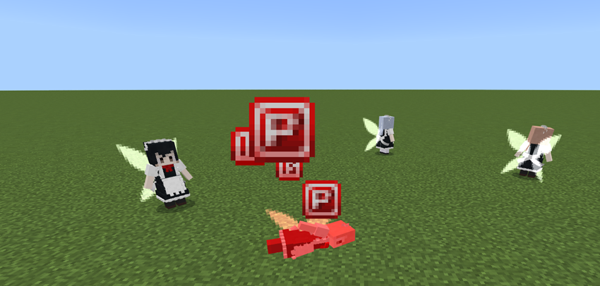
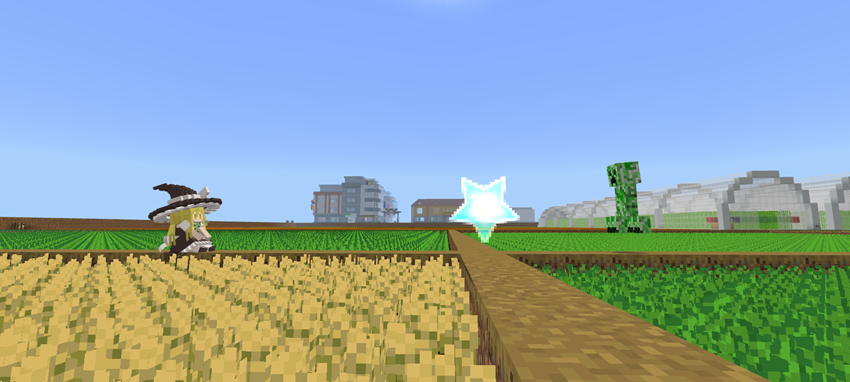

Added cute maids to Minecraft, who can help with battles, farming and other tasks.

Supports custom models, you can easily switch the maid model, or create your own maid model.

This Add-On is a port of Java MOD of the same name, which added cute maids to Minecraft.

**Most tutorials can be found in the in-game guidebook, this article is just a brief introduction to the features.**

## Guidebook

Each player is given a guidebook when they first enter the world.

This book is probably better than anything you've used before: It has the same smooth page turning as a true book, you can also skip chapters, record the last position and return to the first page.

The content can be easily changed, so I may make it a lib in the future.

If you lose it, craft again with cake and book.

## Altar

The altar is the multi-block structure required for the craft of this mod.

To build this, use the gohei to right click on the red wool front left of center of the fourth layer.

You can right click on the top of each of the six pillars to place items. Jump under the pole and pick it up. When the item is fully placed and the Power value is sufficient, the altar can trigger crafting. When crafting is interrupted due to lack of Power, replacing any material after obtaining enough Power can trigger crafting.

There is no need to worry about forgetting to remove the material, the items on the altar will not automatically disappear.

## Power Point

The craft also requires another necessary material: Power Point, which is obtained by killing the maid fairy.

You can also find some in the chest of the desert temple.

When you hold gohei, you can see the power value above the inventory. The maximum power value is 5, and more than this number power point will turn into xp.

## Maid

### Interaction

Different platforms operate in different ways, "Interaction" on the computer side is the right click, on the mobile is the long press; "Attack" on the PC is left click, on the mobile is short press.

1. "Interaction" makes the maid sit or stand up:

2. "Interaction" in sneaking mode to open the backpack.
3. "Attack" in sneaking mode to open GUI:

### Skins

Maid has many skins and supports the import of additional skin packs.

The skin pack creation tool is included with each version .zip, note that different versions of the tool may not work with another version.

Currently, the tool only supports Chinese, so a translator is necessary.

### Combat Mode

There are two types of combat modes: Melee and Ranged.

In Ranged mode, the maid fires danmaku, which deals with magic damage.

### Farming Mode

When farming mode is on, the maid automatically looks for the nearest crop to harvest and replant. The crop type includes almost all the vanilla types and some of the Add-On crops, like Farmers' delight.

Unlike villager harvesting, gamerule "mobgriefing" does not need to be turned on.

What's more, the custom harvest interface will be available in the future.

### Backpack

The backpack can be used to expand the inventory of the maid. It can be applied by holding the backpack, sneaking, and right-click on the maid.

Use the shears to remove the maid's backpack.

### Chisel & Statues

Right-click the clay with a chisel can make statues of different sizes. Currently supports 1x1x1, 1x1x2, 2x2x4, 3x3x6 sizes.

Holds a photo in offhand, chisel in mainhand, then right-clicks the lower left corner of the multi-block structure to engrave the maid in the photo.

The fire roasted 1x1 size statue can be converted into Garage Kit.

### Princess Hug

Hold the saddle, interact with the maid, you can pick her up, interact again, you can put her down.

## Player Weapons

This module focuses on the maid and does not offer many items available to the player.

### Hakurei's Gohei

The gohei is a long-range weapon that shoots danmaku.

When you interact with any block in sneaking mode, you can switch types.

### Cherry Gohei

Launch a bouquet of cherry blossom petals that penetrates multiple entities and deals range damage to creatures near the path.

### Spell Card

Items that cannot be retrieved in Survival mode. Fire a large number of danmaku:

